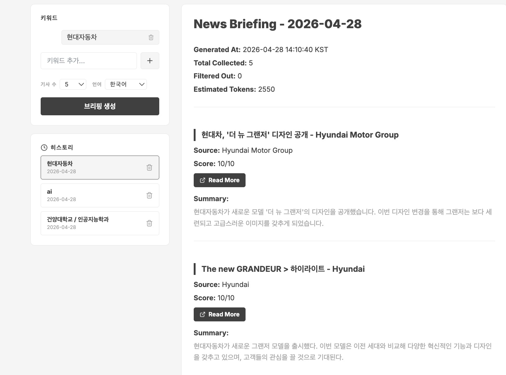
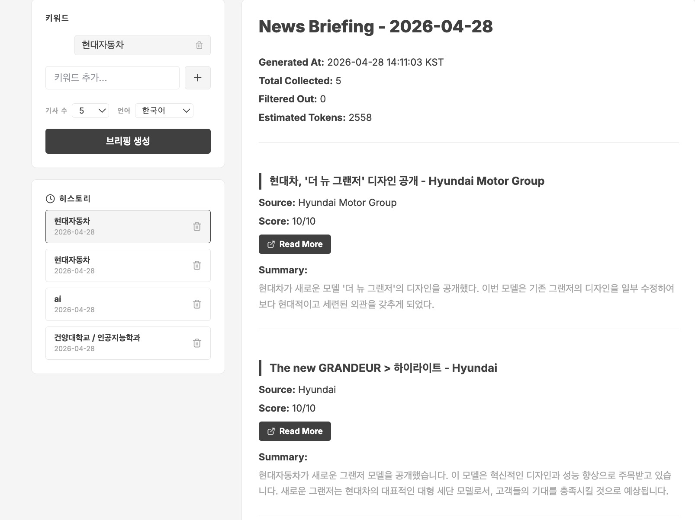
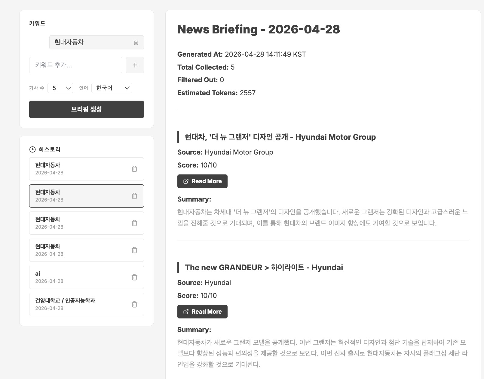
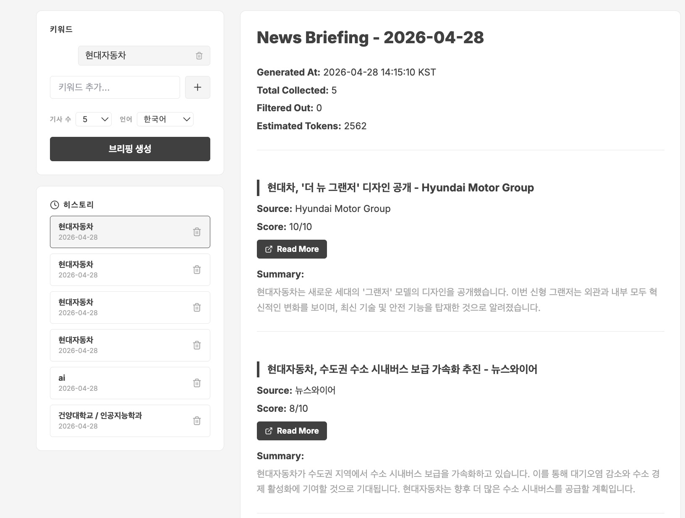
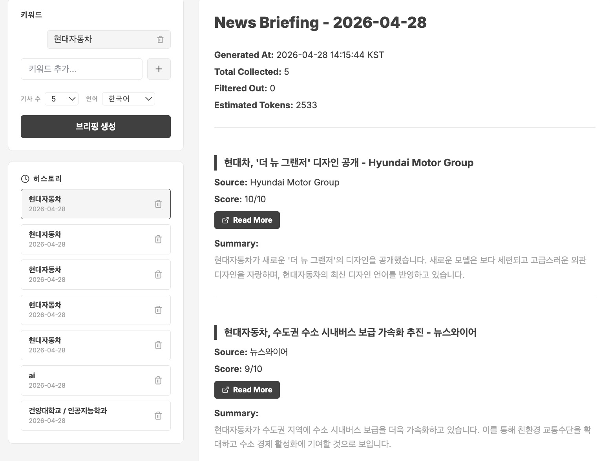

# Briefing Agent

매일 아침 관심 키워드 기반으로 뉴스를 자동 수집·스코어링·요약하여 마크다운 브리핑 파일을 생성하는 Python AI Agent.

---

## 1. 어떤 병목을 다루는가

- **병목 Task:** 매일 뉴스를 수동으로 수집·정리해 브리핑을 만드는 작업
- **빈도:** 매일 1회 / 1회당 약 30~40분
- **왜 병목인가:**
  여러 뉴스 사이트를 직접 탐색해야 하고, 중복 기사를 수동으로 걸러내야 하며, 기사의 중요도를 사람이 주관적으로 판단해야 한다.

---

## 2. 왜 AI Agent로 만들었는가

**룰베이스로 안 되는 이유:**
키워드 포함 여부만으로는 기사의 실제 관련도를 판단할 수 없다. 동일 키워드라도 맥락에 따라 관심도가 크게 다르며, 요약 품질도 단순 추출로는 확보하기 어렵다.

**AI 판단이 필요한 지점:**
- **관심도 스코어링:** 전체 기사 제목·설명을 배치로 읽고 키워드와의 실질적 연관성을 0~10으로 판단 (AWS Bedrock / Claude 3 Haiku)
- **요약 생성:** 기사 본문을 2~3문장으로 압축하여 사용자가 원문 없이 내용을 파악할 수 있도록 생성 (AWS Bedrock / Claude 3 Haiku)

---

## 3. Agent 구조

**처리 흐름:**
```
입력 JSON
  → fetcher (Google News RSS 수집)
  → scorer (Bedrock 배치 스코어링)
  → 중복 제거 + score < 3 필터링
  → summarizer (Bedrock 기사별 요약)
  → writer (briefing_YYYYMMDD.md 생성)
```

**사용 도구:**
| 도구 | 용도 |
|------|------|
| Google News RSS (feedparser) | 키워드 기반 기사 수집 (API 키 불필요) |
| AWS Bedrock (Claude 3 Haiku) | 관심도 스코어링 + 요약 생성 |
| 로컬 파일시스템 | 입력 JSON 읽기, 브리핑 MD 파일 쓰기 |

**핵심 제약:**
- **비용 상한:** 1회 실행당 Bedrock 토큰 합계 50,000 미만. 40,000 도달 시 WARNING, 초과 시 즉시 중단.
- **사람 개입 조건:** keywords 빈 배열 → 즉시 중단 / 수집 0건 → 중단 / 저관련 70% 초과 → WARNING 후 계속
- **도구 화이트리스트:** AWS Bedrock, Google News RSS, 로컬 파일시스템만 허용.

---

## 4. 실행 방법

**1줄 재현 명령:**
```bash
python main.py --input test-input/case-1.json
```

**의존성 설치:**
```bash
pip install -r requirements.txt
```

**필요한 환경변수:** `.env.example` 참조

```bash
cp .env.example .env
# .env 파일에 AWS 자격증명 설정 (또는 IAM Role/환경변수로 대체 가능)
```

> Google News RSS는 API 키가 필요 없습니다. AWS Bedrock 접근 권한만 있으면 됩니다.

---

## 5. 테스트 입력 형식

테스트 입력 파일 위치: `test-input/`

**JSON 키 목록:**

| 키 | 타입 | 필수 | 설명 |
|----|------|------|------|
| `date` | string | 선택 | 브리핑 날짜 (`YYYY-MM-DD`). 미입력 시 오늘 날짜 |
| `keywords` | array[string] | 필수 | 검색 키워드 목록 |
| `max_articles` | int | 선택 | 수집할 최대 기사 수 (기본값: 10) |
| `briefing_lang` | string | 선택 | 요약 언어 (`"ko"`, `"en"` 등, 기본값: `"ko"`) |
| `keyword_operators` | array[string] | 선택 | 키워드 간 연산자 (`"OR"` / `"AND"`, 기본값: 전부 `"OR"`) |

**케이스별 설명:**

| 파일 | keywords | 목적 |
|------|----------|------|
| `case-1.json` | `["AI", "반도체", "애플"]` | 정상 케이스 — 관련도 높은 키워드 |
| `case-2.json` | `["조선시대 도자기"]` | 엣지 케이스 — 저관련 기사 70% 초과 유도 |
| `case-3.json` | `[]` | 실패 케이스 — 빈 keywords, ERROR 출력 확인 |

---

## 6. 실행 결과 (5회)

###1회차

###2회차

###3회차

###4회차

###5회차


